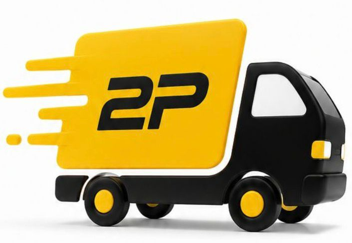

<div align="center">



# **2P BOX**

### Tudo que você precisa, em um só lugar.

**Papelaria · Eletrônicos · Acessórios para celular · Xerox**

[](https://github.com/joaopedro29040404-wq/2pbox)
[](https://nextjs.org/)
[](https://www.typescriptlang.org/)
[](https://supabase.com/)
[](https://vercel.com/)

</div>

---

## ✦ Sobre a 2P Box

A **2P Box** é uma plataforma de e-commerce criada para transformar a experiência de compra da loja em algo mais **simples, rápido e direto**.

O projeto reúne catálogo, categorias, busca de produtos, carrinho e checkout em uma experiência pensada para o cliente final — mantendo uma base pronta para a evolução da operação da loja.

> **2P Box — qualidade, variedade e confiança.**

---

## 🛍️ O que já existe

| Experiência | Recursos |
|---|---|
| **Loja** | Catálogo responsivo e navegação por categorias |
| **Produtos** | Busca, detalhes, preços e imagens |
| **Carrinho** | Inclusão, remoção e controle de quantidade |
| **Checkout** | Retirada na loja e fluxo preparado para entrega |
| **Atendimento** | Opção de contato e frete direcionado ao WhatsApp |
| **Administração** | Produtos, categorias, estoque e pedidos |
| **Pagamentos** | Estrutura preparada para integração com Pagar.me |

---

## ⚡ Stack

**Frontend**  
Next.js · TypeScript · React

**Dados & autenticação**  
Supabase · PostgreSQL · Auth · Storage

**Pagamentos**  
Pagar.me

**Deploy**  
Vercel

---

## 🚀 Rodando localmente

```bash
npm install
npm run dev
```

Depois, abra:

```text
http://localhost:3000
```

### Variáveis de ambiente

Crie um arquivo `.env.local`:

```env
NEXT_PUBLIC_SUPABASE_URL=
NEXT_PUBLIC_SUPABASE_ANON_KEY=
PAGARME_API_KEY=
PAGARME_WEBHOOK_SECRET=
NEXT_PUBLIC_STORE_WHATSAPP=
```

> **Segurança:** nunca publique chaves privadas no GitHub. Credenciais do Pagar.me devem permanecer somente no ambiente de servidor/deploy.

---

<div align="center">

### **2P BOX**

**Tudo que você precisa, em um só lugar.**

_Projeto em evolução._

</div>
