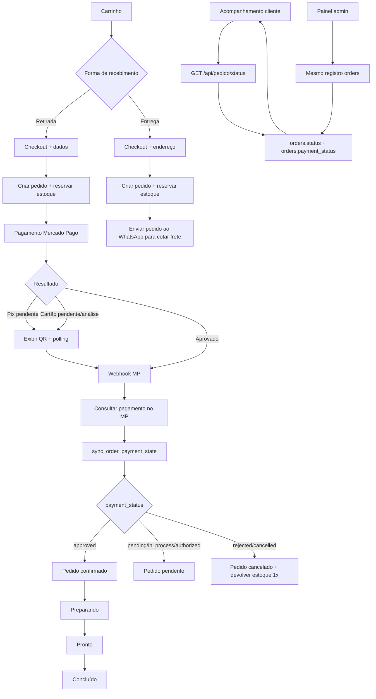

# 2P Box — Fluxo oficial de pedido e pagamento

## Fonte única de verdade

O registro `orders` é a fonte única do estado do pedido. `payment_status` representa o estado do pagamento no Mercado Pago e `status` representa a etapa operacional do pedido.

## Fluxo principal

## Estados do pagamento

- `pending`: pedido criado, pagamento ainda não confirmado.
- `in_process`: Mercado Pago analisando.
- `authorized`: autorizado, aguardando confirmação final.
- `approved`: pagamento confirmado.
- `rejected`: pagamento recusado; pedido cancelado.
- `cancelled`: pagamento cancelado; pedido cancelado.

## Estados do pedido

- `pending`: pedido recebido e aguardando pagamento.
- `confirmed`: pagamento aprovado.
- `preparing`: separação/preparação pela loja.
- `ready`: pronto para retirada.
- `completed`: pedido finalizado.
- `cancelled`: pedido encerrado sem continuidade.

## Regras

1. O cliente cria o pedido uma única vez no checkout.
2. O estoque é reservado na criação do pedido.
3. O pagamento usa `external_reference = orderId`.
4. Webhook e consulta de status passam pela mesma função SQL `sync_order_payment_state`.
5. Um evento atrasado nunca regride um pagamento aprovado para pendente/recusado.
6. Estoque só é devolvido uma vez, usando `stock_restored_at`.
7. Todas as telas devem ler o status do pedido em vez de manter um status local independente.
8. A tela `/checkout/pagamento` existe apenas por compatibilidade e redireciona para `/pagamento/[id]`.
